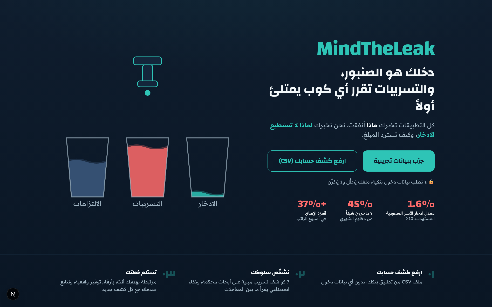
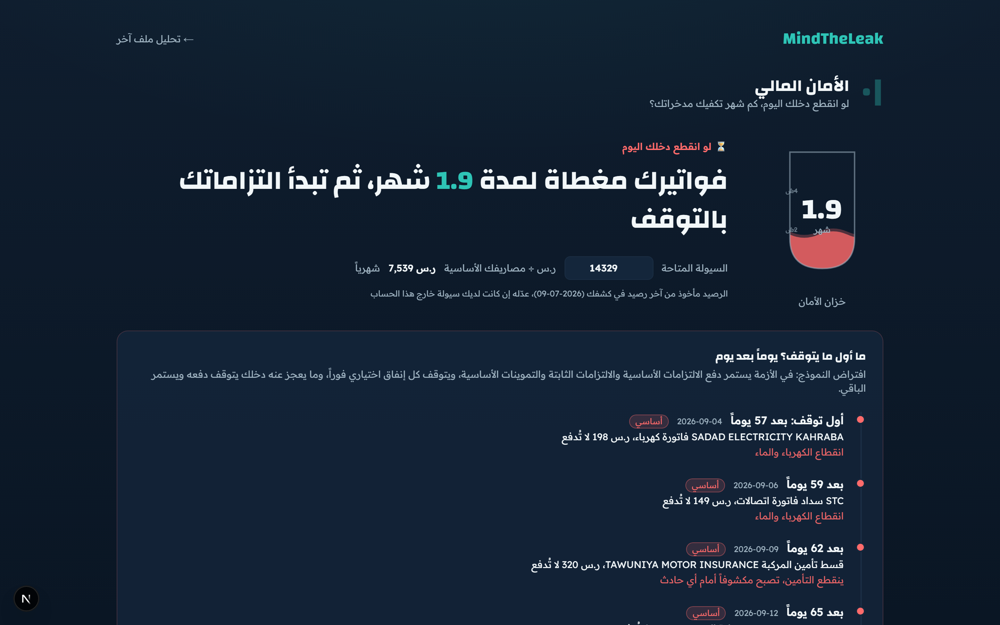
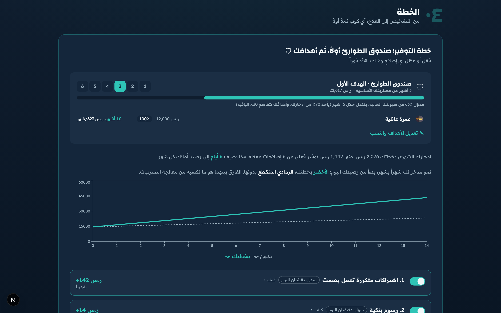
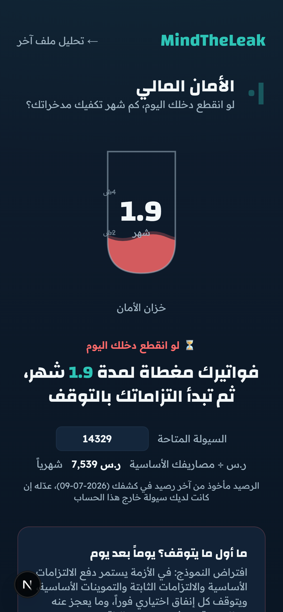

<div align="center">

# MindTheLeak

**دخلك هو الصنبور. التسريبات تقرر أي كوب يمتلئ أولاً.**

Behavioral spending analysis for Saudi bank statements. Local-first, Arabic, no bank login.



</div>

## What it is

Most budgeting apps tell you *what* you spent. MindTheLeak looks at *how* you spend, the payday bursts, the late-night impulse buys, the forgotten subscriptions, and shows what those habits cost over a year and how long your savings would last if your income stopped.

It runs entirely on your own machine. You import a statement file; nothing goes to a bank and no account login is involved.

## The report

It reads your statement and walks you through the same four stages every time.

**How resilient you are.** Your survival floor (what your life costs at its minimum each month), how many months your savings would cover it, and exactly which bills stop first if income stops.



**A plan you can steer.** The emergency fund is funded first, then your goals share the rest. Toggle any fix and watch the effect on your savings immediately, with honest recovery rates rather than promises.



<div align="center">

<br/>
<sub>All screenshots use the built-in demo data.</sub>
</div>

## Try it

```bash
cd app
npm install
npm run dev
```

Open `http://localhost:3000/?demo=1` to load the bundled sample data and see the full report. Add `&static=1` to turn animations off.

To use your own statement, export it as CSV and upload it on the landing page. It never leaves your machine.

## Optional AI layer

Everything above works with no key. If you set `ANTHROPIC_API_KEY` in `app/.env.local`, the app also uses the model to categorize unfamiliar merchants and to write the Arabic narrative in your own numbers. Without a key, built-in rules categorize the common Saudi merchants and a template writes the report from the same figures, so the app is fully functional offline. The key only improves the long tail of merchants and the phrasing of the write-up.

## How it works

- **Parsing** (`app/lib/parse.ts`) handles Saudi bank export quirks: Arabic-Indic digits, RTL marks, debit/credit or signed amounts, `DD/MM/YYYY` dates, and messy merchant strings (including names truncated to ~22 characters).
- **Categorizing** (`app/lib/classify.ts`) matches salary, bills, transfers, fees, and known merchants by rule, and hands the rest to the optional AI layer.
- **Leak detection** (`app/lib/detect.ts`) flags recurring behavioral patterns. Each transaction counts toward at most one leak, so the totals never double-count.
- **Resilience** (`app/lib/resilience.ts`) estimates your monthly survival floor, how many months your savings would cover it, what stops first if income halts, and sizes the emergency fund.

Run the checks with `node app/lib/{parse,detect,resilience}.test.ts` (Node 22.18+).

## Sample data

`app/public/demo.csv` is a generated sample persona (`app/scripts/gen-demo.ts`), so anyone can try the app end to end without real data.
